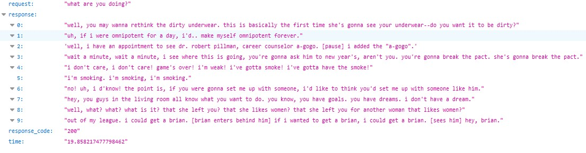

# Разработка Retrieval-Based чат-бота на примере персонажей сериала "Друзья"

**Источник данных:** https://www.kaggle.com/datasets/gopinath15/friends-netflix-script-data 

**Количество записей**: 69974

**Датасет содержит 5 полей:**

* Text – реплика персонажа и технический текст
* Speaker – персонаж, говорящий реплику
* Episode – номер и название эпизода
* Season – номер сезона
* Show – название шоу

## Примеры работы чат-бота

## Структура репозитория
    ├── templates                          # Шаблоны html страниц
    ├────── index.html                     # шаблон главной страницы с ссылками на тесты
    ├── data                               # Данные
    ├────── data.pkl                       # Данные для обучения модели
    ├────── Friends_processed.csv          # Обработанный датасет
    ├── model                              # Модель
    ├────── charact_corpus.pkl             # Корпус реплик персонажа
    ├────── tokenizer                      # Дообученный токенайзер модели
    ├────── friends_model.pkl              # Дообученная модель
    ├── valid                              # Результаты валидации на тестах
    ├── Analysis.ipynb                     # Анализ данных
    ├── Processing.ipynb                   # Обработка данных
    ├── train.py                           # Обучение модели
    ├── inference.py                       # Инференс
    ├── Report_ShmelkovYB.pdf              # Отчет
    └── README.md                          # Краткое описание проекта
